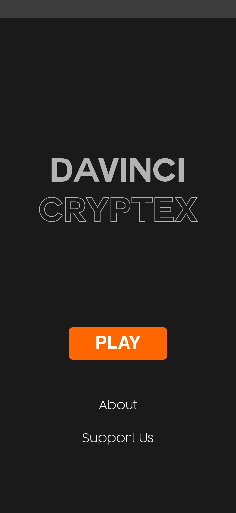
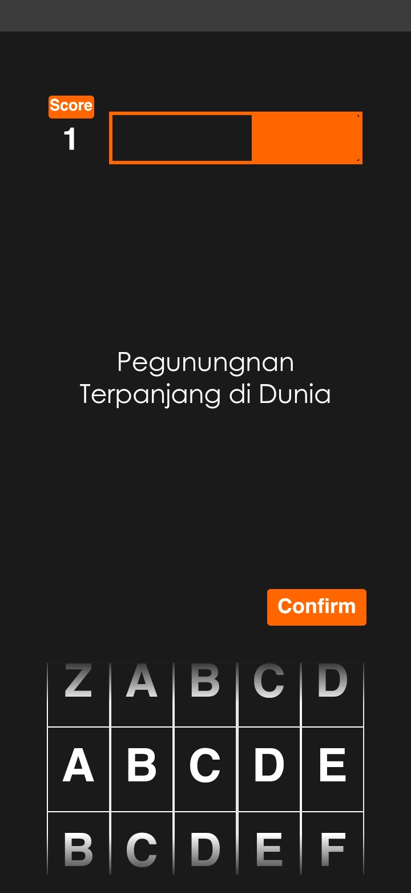

[![Contributors][contributors-shield]][contributors-url]
![last-commit][last-commit-shield]
[![Stars][stars-shield]][stars-url]
[![License][license-shield]][license-url]
 
 

<!-- ABOUT THE PROJECT -->
## About

I think with Flutter we can build some kind of games. And it's real, i've build it with so much trial and error. Some components made from scratch and some of them are combination from many package. I hope it makes you inspired for learn coding, especially Flutter.

This repo is the result of the `flutter build -web`, so the output is javascript. If you curious with the android/Ios version just hit me up <a href="mailto:mapanduprayoga@gmail.com">here</a>

I'd really appreciate it if someone gave a <b>fork</b> or a <b>star</b> to my repo.
 
 

 
For business inquiries please email me at <a href="mailto:mapanduprayoga@gmail.com">mapanduprayoga@gmail.com</a>  
Or you can take a look at the projects I've made here : <a href="https://arif-pandu.github.io">arif-pandu.github.io</a>
 
 

<!-- REFRENCE LINK ON TOP -->
[contributors-shield]: https://img.shields.io/github/contributors/arif-pandu/DaVinci-Cryptex-Game?logoColor=blue&style=for-the-badge
[contributors-url]: https://github.com/arif-pandu/DaVinci-Cryptex-Game/graphs/contributors

[last-commit-shield]: https://img.shields.io/github/last-commit/arif-pandu/DaVinci-Cryptex-Game?style=for-the-badge

[stars-shield]: https://img.shields.io/github/stars/arif-pandu/DaVinci-Cryptex-Game?style=for-the-badge
[stars-url]: https://github.com/arif-pandu/DaVinci-Cryptex-Game/stargazers

[license-shield]: https://img.shields.io/github/license/arif-pandu/DaVinci-Cryptex-Game?style=for-the-badge
[license-url]: https://github.com/arif-pandu/DaVinci-Cryptex-Game/blob/main/LICENSE.txt
